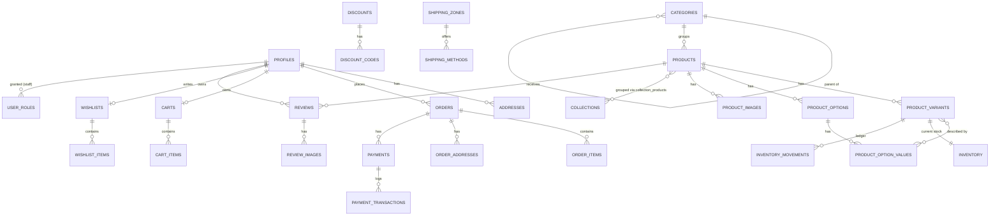

# Database Schema — High Fashion

**Status:** migrations, RLS policies, and seed data are applied and
verified against the hosted Supabase project (ref `vnzynrssckxemredycsw`):
37 tables, all with RLS enabled, 106 policies, 28 triggers. Seed produced 8
active products / 23 variants / 34 variant↔option-value links / 23
inventory rows backed by 23 opening `inventory_movements`.

PostgreSQL schema managed entirely through Supabase migrations in
[supabase/migrations/](../supabase/migrations/) (never hand-edit tables in
the dashboard — add a new migration instead). Reference data (permission
catalog, role→permission mapping) ships as its own migration; dev-only
sample data (products, variants, inventory) lives in
[supabase/seed/seed.sql](../supabase/seed/seed.sql).

## Migration order

| File | Contents |
|---|---|
| `0001_extensions_and_enums.sql` | Extensions (`pgcrypto`, `citext`), every enum type, the shared `set_updated_at()` trigger function |
| `0002_roles_and_profiles.sql` | `permissions`, `role_permissions`, `user_roles`, RBAC helper functions, `profiles`, `addresses`, auto-provisioning trigger |
| `0003_catalog.sql` | `categories`, `products`, `product_options`, `product_option_values`, `product_variants`, `product_variant_options`, `product_images`, `collections`, `collection_products` |
| `0004_inventory.sql` | `inventory`, `inventory_movements`, and the triggers that keep them in sync |
| `0005_cart_wishlist.sql` | `carts`, `cart_items`, `wishlists`, `wishlist_items` |
| `0006_orders.sql` | `orders`, `order_items`, `order_addresses` (historical snapshots — see below) |
| `0007_payments.sql` | `payments`, `payment_transactions` |
| `0008_discounts.sql` | `discounts`, `discount_codes` |
| `0009_reviews.sql` | `reviews`, `review_images` |
| `0010_shipping_tax.sql` | `shipping_zones`, `shipping_methods`, `tax_rates` |
| `0011_marketing_content.sql` | `newsletter_subscribers`, `pages`, `blog_posts` |
| `0012_settings_audit.sql` | `settings`, `audit_logs`, `log_audit_event()` trigger function |
| `0013_audit_triggers.sql` | Attaches the audit trigger to sensitive tables |
| `0014_rls_policies.sql` | Enables RLS and defines every policy, table by table |
| `0015_seed_role_permissions.sql` | Reference data: permission catalog + default role→permission grants |

## Entity overview



## Identity model

`profiles.id` **is** `auth.users.id` — not a separate surrogate key joined
through a `customer_id`. A row is created automatically by the
`handle_new_user()` trigger the moment someone signs up. This means every
"owned by the current user" RLS check anywhere in the schema is a plain
`profile_id = auth.uid()` — no join required, and no risk of an orphaned
profile.

## Product catalog

- **`products`** carries name, slug, description, base SKU, `status`
  (`draft`/`active`/`archived`), brand, a single primary `category_id`,
  a `tags text[]`, SEO fields, and a free-form `metadata jsonb` for
  anything that doesn't need its own column.
- **`product_variants`** is the actual sellable unit — **price, compare-at
  price, cost, size, color, material, weight, and barcode all live here**,
  never on `products`. A product with no real variation still gets exactly
  one variant row (see the Canvas Tote Bag in the seed data).
- **`product_options` / `product_option_values`** is a generic,
  merchant-configurable option system (any option name, any values) linked
  to variants through `product_variant_options`. The first-class
  `size`/`color`/`material` columns on `product_variants` exist *in
  addition to* this generic system — they're what the storefront reads for
  fast filtering/display; the generic tables exist so a merchant can add an
  arbitrary option (e.g. "Strap Length") without a schema change. Keep both
  in sync when a variant's size/color changes.
- **`product_images`** belongs to a product and can optionally pin to one
  `variant_id` (e.g. only the Black colorway's photos).
- **`categories`** is a single self-referencing hierarchy (a product has at
  most one primary category via `products.category_id`).
- **`collections`** is an independent many-to-many grouping (via
  `collection_products`) for marketing purposes — a product can be in
  "New In" and "Best Sellers" simultaneously regardless of its category.

## Inventory

- **`inventory`** is a 1:1 snapshot per variant: `on_hand`, `reserved`, and
  a *generated* `available` column (`on_hand - reserved`, computed by
  Postgres — never written directly). A row is created automatically for
  every new variant.
- **`inventory_movements`** is the append-only ledger and the only
  intended write path. Insert a movement with a `type` (`restock`, `sale`,
  `return`, `adjustment`, `reservation`, `release`, `transfer`) and a
  signed `quantity`; a trigger (`apply_inventory_movement()`) applies its
  effect onto `inventory` automatically:
  - `restock` / `return` / `adjustment` / `transfer` → `on_hand`
  - `sale` → `on_hand` (always subtracts, regardless of sign)
  - `reservation` → `reserved` (adds)
  - `release` → `reserved` (subtracts)

  Both maintenance triggers on this table are `security definer`, so a
  caller only ever needs `INSERT` on `inventory_movements` — they don't
  need a direct grant to `UPDATE inventory`, which stays staff-write-only.
  **Never `UPDATE inventory` directly** from application code; always
  record a movement so the ledger and the snapshot can't drift apart.

## Orders — historical snapshots

Orders must remain readable exactly as they were at purchase time, even
after the catalog changes underneath them. `order_items` therefore stores
its own `product_name`, `variant_title`, `sku`, `image_url`, and
`unit_price_cents` — **it does not join back to `products`/
`product_variants` for display**. Those FK columns
(`order_items.product_id` / `order_items.variant_id`) are nullable with
`ON DELETE SET NULL` specifically so a line item survives a product being
deleted later; they're for analytics/support lookups ("show me all orders
containing this variant"), not for reconstructing what the order *was*.

Likewise, `order_addresses` duplicates the shipping/billing address at
time of purchase rather than referencing the customer's `addresses` row —
the customer can edit or delete a saved address after the fact without
altering historical orders.

`orders.order_number` auto-generates as `HF-100001`, `HF-100002`, … from
`order_number_seq`.

**No client-side writes.** `orders`, `order_items`, `payments`, and
`payment_transactions` are money-moving/legal records — the `authenticated`
and `anon` roles can only ever `SELECT` them (customers their own, staff
per role below). Creating an order and taking payment must go through a
Supabase Edge Function using the service role key (see
`supabase/functions/create-payment-intent`), which bypasses RLS entirely by
design — that Edge Function is the trust boundary, not a client-side
Postgres policy.

## Admin roles & permissions

Six roles (`admin_role` enum): `super_admin`, `admin`, `inventory_manager`,
`order_manager`, `content_manager`, `customer_support`. A user can hold
more than one (`user_roles` has no uniqueness constraint beyond
`(user_id, role)`).

- **`permissions`** — a fixed catalog (`products.read`, `inventory.write`,
  `orders.write`, `users.manage`, …), seeded in `0015_seed_role_permissions.sql`.
- **`role_permissions`** — maps each role to its permissions. `super_admin`
  gets everything; `admin` gets everything **except** `users.manage`
  (only `super_admin` can grant/revoke roles — see RLS below); the other
  four roles get a scoped subset matching their name.
- **`user_roles`** — who actually holds which role.
- Helper functions (all `SECURITY DEFINER`, safe to call from RLS
  policies or via RPC from the client): `has_role(role)`,
  `has_any_role(variadic roles)`, `is_staff()`, `has_permission(key)`.

The `permissions`/`role_permissions` tables exist for the admin dashboard
to introspect "what can this role do" and for future fine-grained checks;
the RLS policies shipped in this batch key off `has_any_role(...)` directly
against specific roles rather than `has_permission()`, since the policy
surface is small enough to read at a glance — switch individual policies to
`has_permission()` calls as the permission catalog grows past what's
convenient to spell out per-table.

## Row Level Security

RLS is enabled on **every** table with no implicit access — every allowed
path is an explicit policy in `0014_rls_policies.sql`. Summary:

| Data | Customer access | Staff access |
|---|---|---|
| Own profile / addresses | Full (own row only) | Read: `customer_support`, `order_manager`, `admin`, `super_admin` |
| Products / variants / images / options | Read `active` only | `content_manager`+ read everything, write |
| Inventory levels | Public read (see trade-off note below) | `inventory_manager`+ write |
| Inventory movements | No access | `inventory_manager`, `order_manager`+ read/write |
| Cart / cart items | Own (or guest, unauthenticated) | Read: `customer_support`, `order_manager`+ |
| Wishlist | Own only | — |
| Orders / order items / addresses | Read own only, no writes | Read: `order_manager`, `customer_support`+; write: `order_manager`+ |
| Payments / transactions | Read own order's payments only | Read: `order_manager`+; no client writes at all |
| Discounts / codes | No access | `order_manager`+ (content_manager can read) |
| Reviews | Own: full; others: only if `approved` | `content_manager`+ full (moderation) |
| Shipping zones/methods, tax rates | Public read | `order_manager`+ write |
| Newsletter subscribers | Insert only (subscribe) | `content_manager`+ read/write |
| Pages / blog posts | Read `published` only | `content_manager`+ full |
| Settings | No access | `admin`/`super_admin` only |
| Audit logs | No access | `admin`/`super_admin` read-only (never client-writable) |
| `user_roles` / `permissions` / `role_permissions` | No access | Read: any staff; write: `super_admin` only |

**Trade-offs worth knowing about, explicitly:**

- **`inventory` is publicly readable** (including exact `on_hand`/`reserved`
  counts) so the storefront can show live stock/low-stock badges without an
  extra network hop. If exact counts turn out to be commercially sensitive,
  swap this for a view/RPC that only exposes a boolean or a bucketed
  "low stock" flag and lock the raw table down to staff.
- **Guest carts are reachable by anyone holding the cart's UUID.** There's
  no server session for anonymous shoppers under the public `anon` key, so
  `carts`/`cart_items` where `profile_id IS NULL` are open — the
  hard-to-guess cart id is the de facto capability token, the same trust
  model most storefronts use for a guest-cart cookie. Once a shopper signs
  in, the application should claim the cart by setting `profile_id`.
- **Discount codes are not publicly listable.** Staff can read the
  `discounts`/`discount_codes` tables; a shopper cannot browse them via
  Postgres directly. Validating a code at checkout should go through a
  `SECURITY DEFINER` RPC (not yet written) that checks validity and returns
  only a yes/no + the discount amount, so codes can't be enumerated by
  scraping a public SELECT policy.

## Audit logging

`audit_logs` is populated automatically by `log_audit_event()`
(`SECURITY DEFINER`, so it writes regardless of the acting role's own
grants) attached to: `products`, `product_variants`, `orders` (updates
only — status/note changes), `discounts`, `discount_codes`, `user_roles`
(role grants/revokes), `settings`, `pages`, `blog_posts`. Each row captures
`actor_id` (`auth.uid()`), the operation, the table, the affected row's id,
and a full `before`/`after` JSONB snapshot. High-churn tables
(`cart_items`, `inventory_movements` — already its own ledger) are
deliberately excluded to keep the log meaningful rather than noisy.

## Seed data

`supabase/seed/seed.sql` creates: 3 top-level + 6 child categories, 3
collections, 8 products spanning men's/women's/accessories with realistic
size/color variant matrices (23 variants total), their options/option
values, placeholder images (`picsum.photos` — **not** the reference site's
assets), opening stock loaded through `inventory_movements` (one SKU
intentionally left near its low-stock threshold to exercise that UI state),
shipping zones/methods, sample tax rates, and a `WELCOME10` discount code.
Run it with `supabase db reset` for a clean local DB, or
`psql <connection-string> -f supabase/seed/seed.sql` against an
already-migrated hosted dev project.

## Regenerating TypeScript types

After migrations are applied, regenerate the app's `Database` type (see
[src/types/database.ts](../src/types/database.ts), which currently still
holds the simplified Batch 1 placeholder schema):

```bash
supabase gen types typescript --linked > src/types/database.ts
```

**This will not match Batch 1's repositories** (`src/repositories/*.ts`)
— those were written against the placeholder schema (e.g. `products.price_cents`,
`products.handle`) and need to be rewritten against the real shape (price
lives on `product_variants`, slug is `products.slug`, etc.). That refactor
is intentionally out of scope for this batch; do it before wiring up any
page that reads from these tables.
